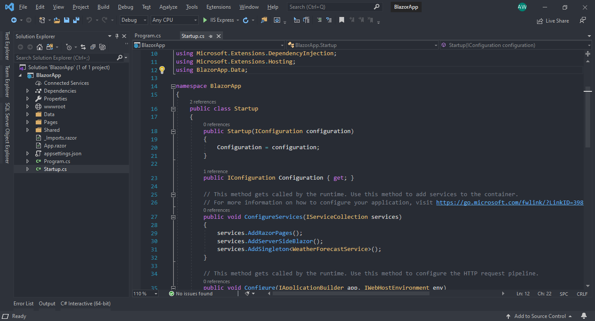
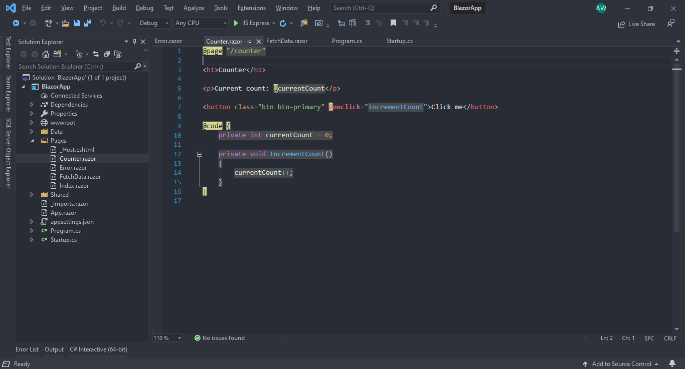
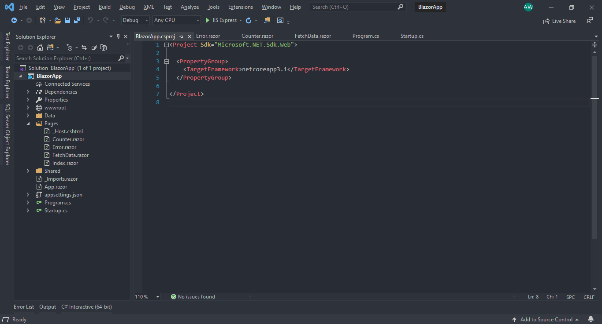

# One Dark Pro

*One Dark Pro* theme for *Visual Studio* generated using Alexander Teinum's *[Dainty for Visual Studio](https://github.com/alexanderte/dainty-vs)*, saved with *[Visual Studio Color Theme Designer](https://marketplace.visualstudio.com/items?itemName=ms-madsk.ColorThemeDesigner)* and tweaked to closer match Binaryify's *[One Dark Pro](https://marketplace.visualstudio.com/items?itemName=zhuangtongfa.Material-theme)* theme for *Visual Studio Code*.

## Contributors

- Thanks to Eric-Arz for C++ syntax highlighting.
- Thanks to Fotis G. Pappas for ReSharper support.
- Thanks to Brandon Foss for fixing vertical tabs.
- Thanks to Mr CSharp and Jacek Ratajewski for their PRs porting this theme to Visual Studio 2022.
